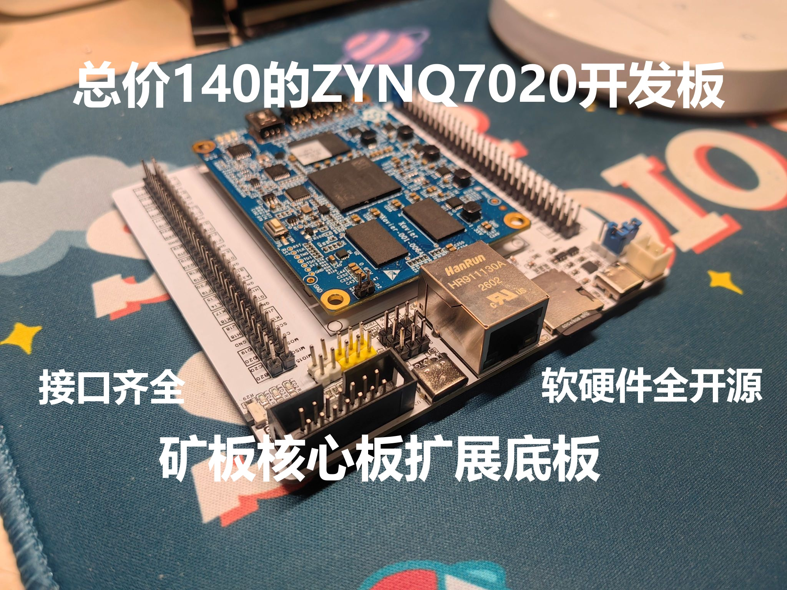
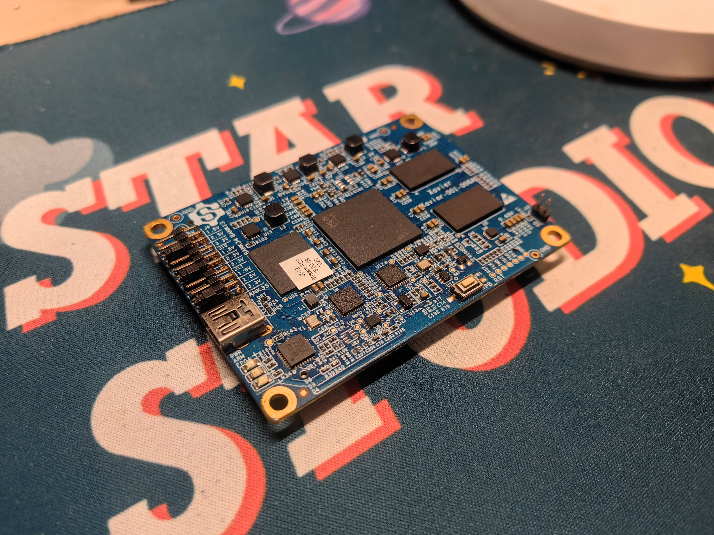
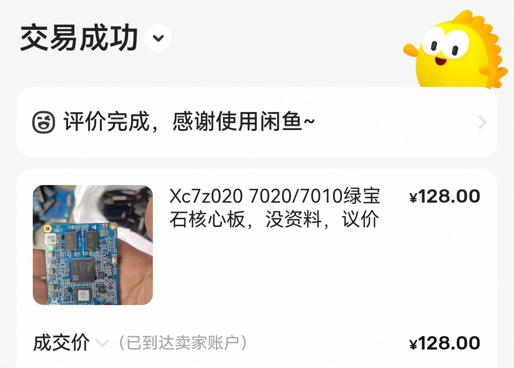
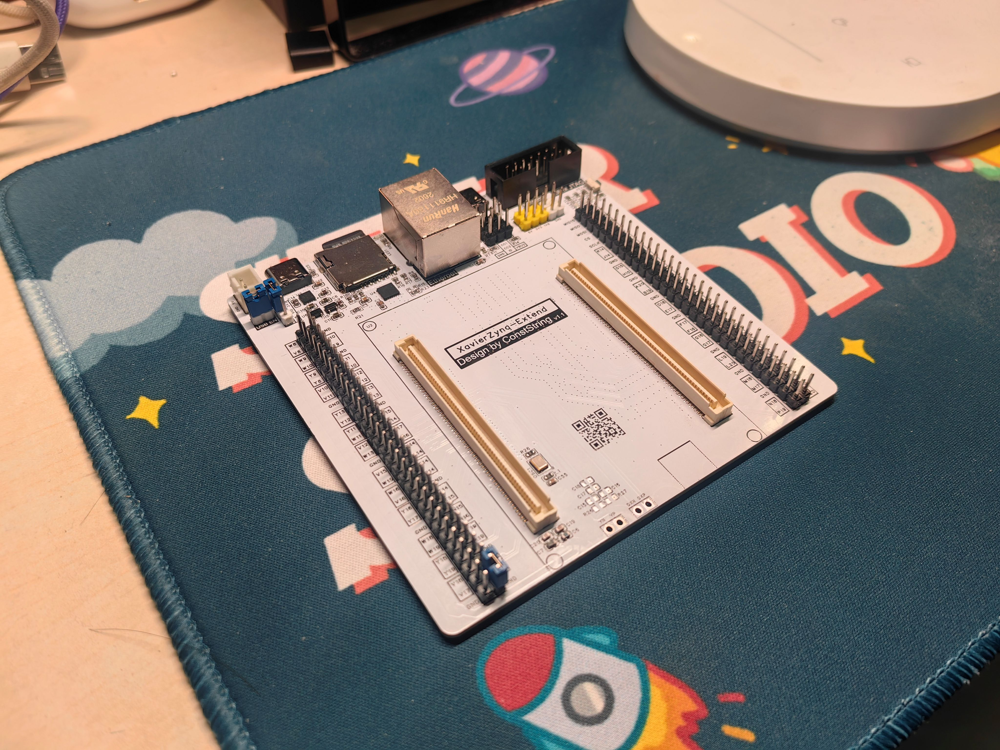
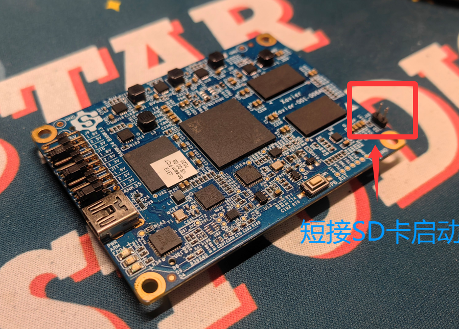
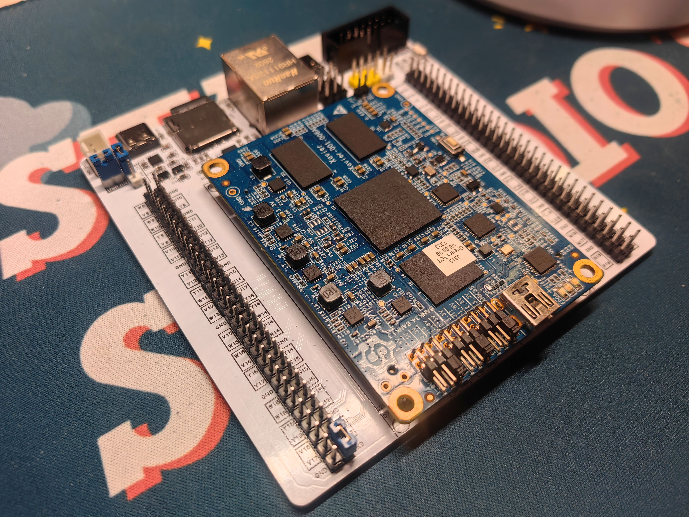
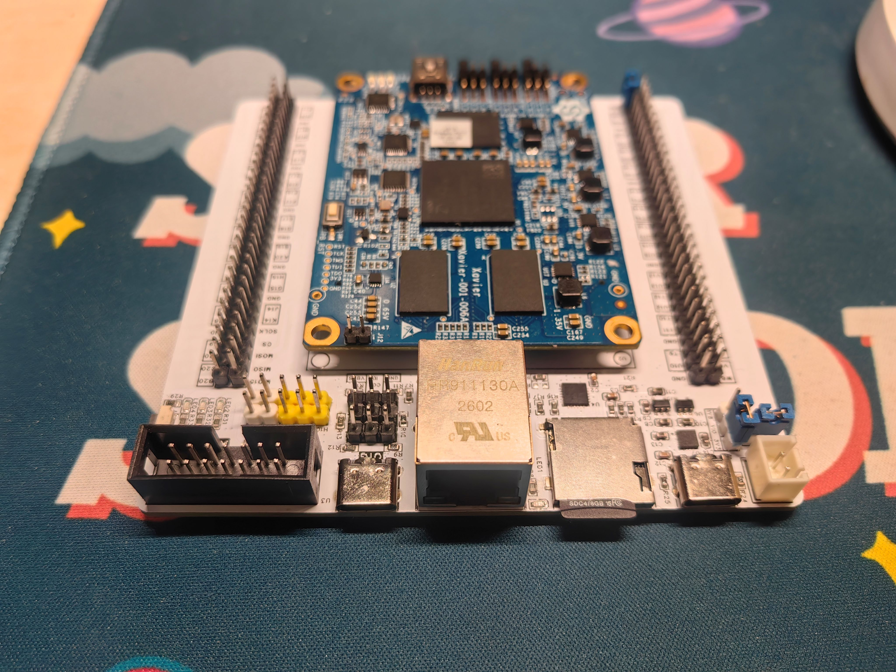

## ZYNQ7020矿板核心板扩展底板，总成本仅140（含核心板）
## 项目简介
**对于初学FPGA的同学，ZYNQ是比较合适的型号，但资源相对较多的7020开发板目前价格偏高，自己焊接核心板难度过高。大约在1年前刷闲鱼的时候偶然发现了这块拆机核心板，价格便宜资源也比较丰富，于是准备设计一块底板。**
**第一版工作正常，但是这个核心板的PL端是没有晶振的，也没有预留焊盘。虽然可以通过PS将时钟引到PL端，但每次工程都这样操作舒适是比较痛苦。于是有了第二版，在PL端添加50MHz有源晶振**
**本项目的目标是让更多FPGA学习者用上便宜好用的开发板**

## 核心板简介
**核心板在闲鱼购买，有不完整资料，本工程是根据不完整资料自行补全的。目前该核心板售价在120元左右。资料我放在本文最后。**
核心板资源如下：
配置：
- 1、ZYNQ7020-CLG400
- 2、ddr3: 4Gbit MT41K256M16TW  D9SHD 2片，总内存32位1GB
- 3、eMMC：MTFC4GACAAAM-1M JWA57 4Gbit
- 4、flash:winbond 25q128FVSG
- 5、铁电存储器：AT88SC
- 6、网口芯片：AR8035 千兆
- 7、USB串口芯片：FT232RQ
- 8、高速USB芯片：USB3320C
- 9、DCDC：TLV62130RGTR   3～17V 3A
- 1、ZYNQ7020-CLG400
- 2、ddr3: 4Gbit MT41K256M16TW  D9SHD

## 底板接口简介
**底板引出JTAG，USB OTG，千兆以太网，SD卡，USB转串口以及多路电源。此外，核心板晶振位于PS端使用不便，底板在PL端添加50Mhz有源晶振**

## 例程资源
根据底板上的基本外设，提供最基本流水灯和按键位移灯（含按键消抖），以及Flash固化和SD卡固化的例程，下载请前往Github: https://github.com/ConstStrings/XavierZynq-Extend

## 使用方法
- 核心板上可以通过跳线帽选择Bank电压，PS端电压固定为1.8V这个是不能调节的，PL端的Bank可以自行选择电压以适应不同外设
- 底板上有IO电压选择跳线帽，需要根据核心板上实际设置的电压选择，否则串口会工作异常
- 支持使用外部电源供电或者USB供电，使用USB供电时插串口Type-C，同时记得短接USB EN跳线帽
- 默认启动方式为从Flash启动，如果需要从SD卡启动需要短接排针，位置如下图所示：

## 成品展示

## 联系作者
如有问题可以邮箱联系：
conststrings@gmail.com

